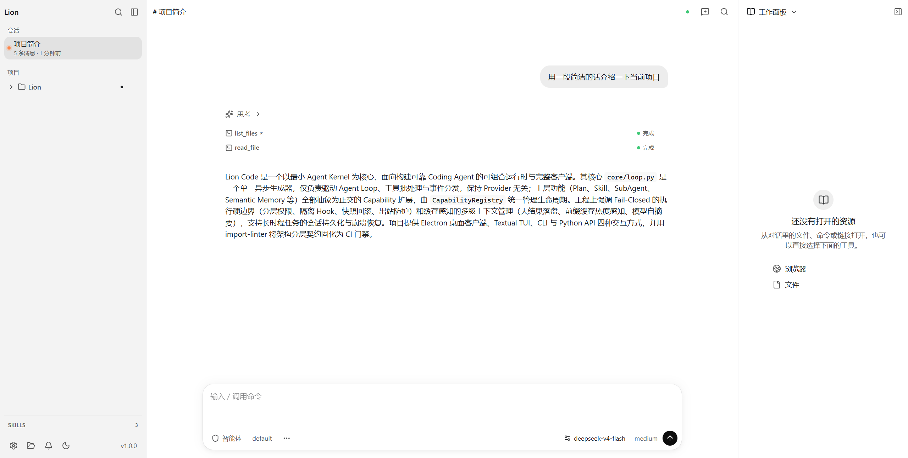
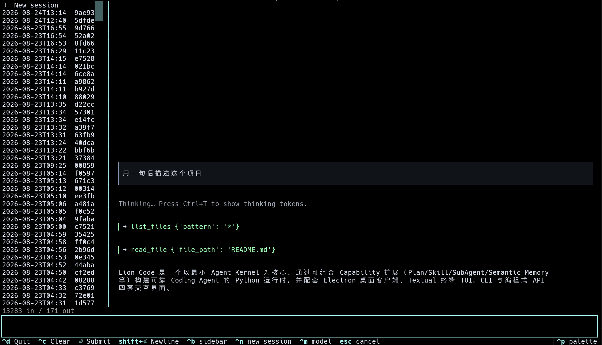
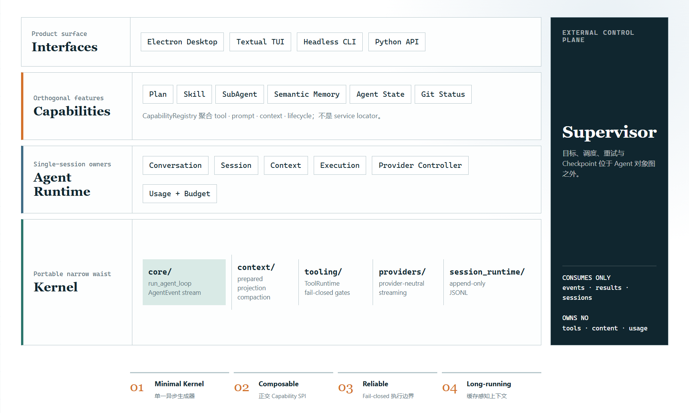
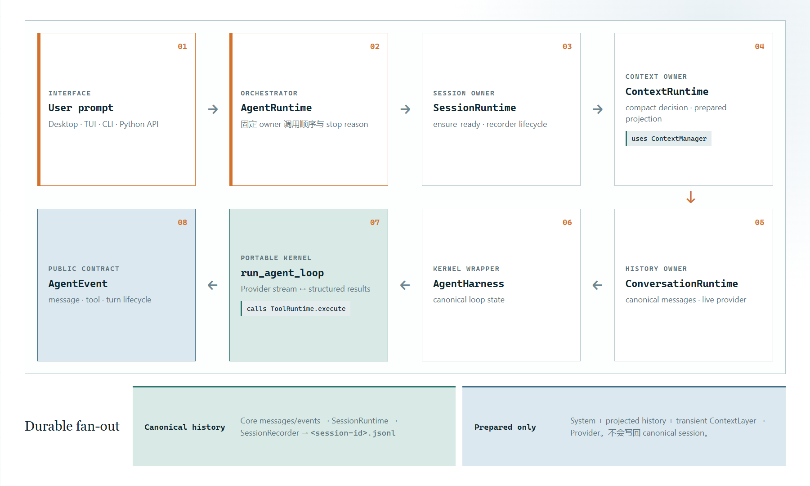
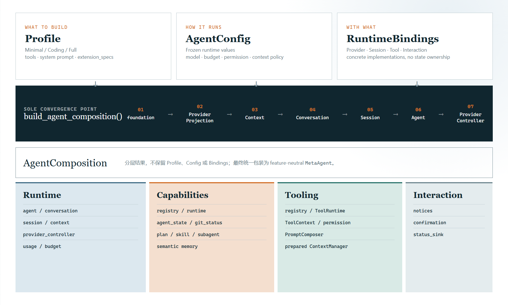
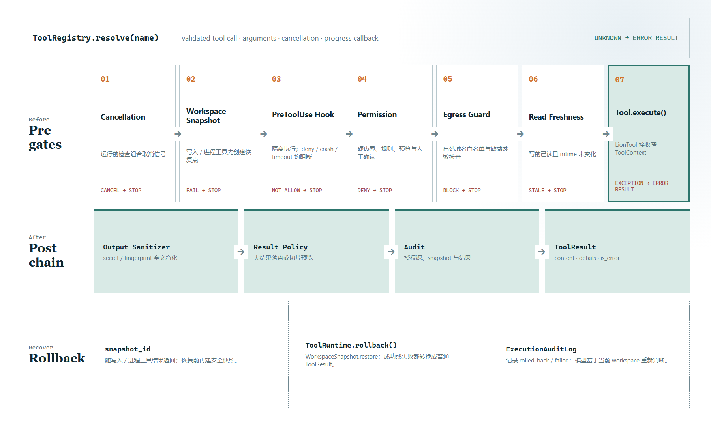

<div align="center">

# Lion Code

**以最小 Agent Kernel 为核心、面向可靠 Coding Agent 构建的可组合运行时与完整客户端**<br/>
*A composable runtime for building reliable Coding Agents, built around a minimal agent kernel.*

[](https://www.python.org/)
[](LICENSE)
[](https://github.com/muyuzhong/Lion-Code/actions/workflows/ci.yml)
[](pyproject.toml)
[](#路线图)

[产品体验](#产品界面) · [核心特性](#为什么选择-lion-code) · [快速开始](#快速开始) · [架构设计](#架构设计) · [工程设计](#核心工程设计) · [内置能力](#内置核心能力) · [交互界面](#交互界面与使用)

</div>

---

## 产品界面

Lion Code 提供覆盖桌面 GUI、终端 TUI、命令行 CLI 以及 Python 编程式 API 的完整交互矩阵。

### 1. Electron 桌面客户端（Primary GUI）

桌面端采用 **Electron + React 19 + `@assistant-ui/react`** 构建，由独立的 API-only Python Sidecar（FastAPI / WebSocket）托管会话运行时，实现严格的进程隔离与工作区管理：

<p align="center">
  
</p>

### 2. Textual 终端 TUI（Terminal GUI）

基于 [Textual](https://textual.textualize.io/) 构建的流式终端应用，支持会话热切换、模型配置、实时路径/命令补全与工具卡片折叠：

<p align="center">
  
</p>

---

## 为什么选择 Lion Code

很多 Coding Agent 演示项目止步于“模型调用工具，工具返回结果”。但在真实复杂长任务中，决定系统可靠性的关键在于：**核心内核是否足够小、扩展能力是否可组合、工具执行是否具备安全硬边界、以及上下文在几十轮高频工具交互后能否稳定维持。**

Lion Code 围绕这四个核心支柱进行工程构建：

<p align="center">
  
</p>

### 01 · Minimal Agent Kernel（最小核心内核）
Kernel 绝不塞入业务特化逻辑。核心（`core/loop.py`）仅作为一个**单一异步生成器**，纯粹负责驱动 Agent Loop、工具调用批处理、上下文投影准备、取消信号中断（`CancellationToken`）与事件流分发（`AgentEvent`）。核心保持 Provider 完全无关，上层功能膨胀零污染。

### 02 · Composable Capabilities（可组合能力平面）
上层功能（Plan、Skill、SubAgent、Semantic Memory、Agent State、Git Status 等）全部抽象为正交的 Capability 扩展（`capabilities/`），由 `CapabilityRegistry` 统一管理生命周期与状态注入。支持按需组合或替换实现（例如通过 `extension_specs` 注入第三方向量检索记忆引擎）。

### 03 · Reliable Execution（Fail-Closed 执行硬边界）
面向长时程与无人值守任务的防御模型：
- **分层权限控制**：提供 `default` / `accept-edits` / `dont-ask` / `yolo` 四级渐进权限。
- **Fail-Closed 命令 Hook**：`PreToolUse` Hook 在隔离子进程运行，严禁传递敏感环境变量（API Key、云凭据），崩溃/超时/非法输出一律拒绝执行，并受复合指纹信任机制保护。
- **状态防御与出站控制**：写操作前强校验读取新鲜度（Read Freshness）、工作区无条件快照回滚（Workspace Snapshot）、出站域名白名单与敏感数据脱敏（Egress Guard & Secret Redaction）。

### 04 · Long-running Context（缓存感知长上下文管理）
拒绝无脑全量截断。采用多级上下文预算管道：
- **大结果落盘**：超大工具输出（>30 KB）自动持久化至本地，上下文仅保留切片预览与回读路径。
- **缓存热度感知**：在前缀缓存温热（< 5 分钟）时延迟裁剪陈旧结果，避免打碎 LLM Prefix Cache，显著提升缓存命中率。
- **模型自摘要**：高负载水位时由同一 Provider 提取关键路径、决策与剩余状态执行精确压缩。

---

## 快速开始

### 1. 环境准备

需要 **Python 3.12+** 环境：

```bash
git clone https://github.com/muyuzhong/Lion-Code.git
cd Lion-Code
python -m venv .venv
source .venv/bin/activate   # Windows: .venv\Scripts\Activate.ps1
pip install -e .
```

### 2. 快速运行

#### 运行 CLI 命令
```bash
# Anthropic API
export ANTHROPIC_API_KEY="<你的 API Key>"
lion-code "读取当前项目并总结最重要的执行路径"

# OpenAI-compatible API
export OPENAI_API_KEY="<你的 API Key>"
export OPENAI_BASE_URL="https://api.openai.com/v1"
lion-code --model "gpt" "检查这个项目并运行测试"
```

#### 常用参数
```bash
lion-code --plan "设计一个重构方案"                   # 激活只读规划（Plan 模式）
lion-code --accept-edits "修复测试并说明原因"          # 自动批准文件编辑
lion-code --max-cost 0.50 --max-turns 20 "完成任务 X"  # 严格预算与轮次控制
lion-code --resume                                     # 自动恢复最近一次会话
```

#### 启动终端 TUI
```bash
lion-code
```

---

## 架构设计

Lion Code 在架构上将**运行时数据流（Runtime Data Flow）**与**构建装配流（Composition Flow）**清晰拆分为两个正交维度。

### 1. 运行时数据流架构（Runtime Architecture）

回答：*Lion Code 包含哪些模块，运行时数据如何流动？*

<p align="center">
  
</p>

### 2. 组合构建架构（Composition Architecture）

回答：*Lion Code 为什么极易扩展且各组件互不耦合？*

装配根（`composition/agent_builder.py`）是一次性构造对象图的唯一场所，输入三轴严格正交：

<p align="center">
  
</p>

内部对象图按照严格的单向拓扑顺序创建，杜绝循环依赖与二段式延迟绑定：

```text
foundation ──► ContextRuntime ──► ConversationRuntime ──► SessionRuntime ──► AgentRuntime ──► ProviderController
```

#### 产品 Profile 预设
- `MinimalProfile`：零内置 Capability 的最小产品，仅装配调用方 tools 与外部 extension。
- `CodingProfile`：内置全套 Coding Tools 与安全 Harness 策略。
- `FullProfile`：**默认包含全套内置能力**（`Skill` + `SubAgent` + `Plan` + `Semantic Memory`），并支持通过 `extension_specs` 替换为自定义能力引擎。

#### 架构分层契约（Import-Linter 门禁）
在 `pyproject.toml` 中通过 `import-linter` 将模块依赖关系固化为 CI 强制门禁：
- `core` 严禁依赖任何上层运行时包与能力包；
- `providers` 仅依赖 `core` 抽象，零 SDK 绑定（纯 `httpx` 驱动）；
- `capabilities` 绝不依赖 Agent 宿主与 UI 应用层；
- `supervisor` 独立于 Agent 内部对象图，仅消费公开事件契约。

---

## 核心工程设计

### 1. Provider 无关的核心循环（Agent Kernel）

Core Runtime 是一个位于 `lion_code/core/loop.py` 的**单一异步生成器**（`run_agent_loop`），同时适配 Anthropic、OpenAI-compatible 以及用于确定性测试的 Fake Provider。

每轮循环通过三个动态钩子实现自适应调整，无需重建运行时：
- `get_system()`：动态合并 Plan 模式、Skill 激活与工具声明的最新上下文。
- `get_tools()`：动态注入 MCP 工具、延迟激活的 Skill 与 Sub-agent 工具集。
- `prepare_context(messages)`：生成经过投影、裁剪与预算控制的 Provider 消息序列。

支持**智能并行工具批处理**：相邻的并行工具分组为并发批次，串行工具则自动作为隔离屏障安全执行。

### 2. Fail-Closed 工具执行边界（Tooling Boundary）

工具执行流经严密的拦截管道，任何环节异常均 Fail-Closed：

<p align="center">
  
</p>

- **隔离 Hook 体系**：Hook 从 stdin 接收 UTF-8 JSON，执行超时、异常退出或畸形输出均触发 `fail-closed` 阻断。敏感凭据（`*_API_KEY`、`AWS_*` 等）被严格禁止传入子进程。项目级 Hook 基于“规范化路径 + 配置哈希 + 脚本内容哈希”生成复合指纹，防范恶意篡改。
- **状态保护与出站防护**：文件写入前强校验读取时间戳（防外部并发覆盖）；网络请求由 `EgressGuardMiddleware` 拦截，阻断非白名单出站请求并对登记密钥执行全文脱敏（Redaction）。

### 3. 多级上下文管理（Context Management）

| 阶段 | 触发水位 | 处理行为 | 缓存友好 |
|------|----------|----------|:---:|
| **大结果持久化** | 工具输出 > 30 KB | 全文落盘至 `~/.lion-code/tool-results/`；上下文仅留路径与首尾预览 | — |
| **动态预算** | 窗口利用率 > 50% | 动态限制单次工具输出长度，保留头尾关键信息 | — |
| **陈旧结果裁剪** | 窗口利用率 > 60% | 将历史远端工具结果替换为 `[result truncated]` 占位符 | ✓ |
| **空闲清理** | 距上次调用 > 5 分钟 | 清理更早轮次的工具结果，保留最近 3 项 | ✓ |
| **模型压缩摘要** | 窗口利用率 > 85% | 同模型提取具体决策、文件路径、命令故障与剩余工作进行结构化压缩 | — |

**缓存热度感知**：当 Provider 前缀缓存处于温热状态（< 5 分钟）时，系统主动延迟裁剪旧结果，即使超过 60% 阈值也维持前缀不变，直到达到 75% 强制覆盖水位，用少量 Token 缓冲换取极高的缓存复用率。

### 4. 会话持久化与崩溃恢复（Session & Recovery）

- **Append-Only JSONL 格式**：会话历史逐行追加并执行 `fsync`，进程意外崩溃最多损失最后半行，绝不破坏历史数据完整性。
- **透明格式迁移**：启动时自动发现旧版 JSON 会话并安全迁移至 JSONL。
- **Supervisor 检查点**：长期任务的恢复由外部 Supervisor 维护轻量 Checkpoint（包含 Goal、Phase、Attempt、Status 与 Session Reference），与底层会话历史正交解耦。

---

## 内置核心能力

Lion Code 内置开箱即用的高阶编码能力，全部实现为独立的 Capability 模块：

```text
lion_code/capabilities/
├── memory/       # 跨会话 Semantic Memory 存储、检索与注入
├── plan/         # 结构化只读规划模式与执行审批
├── skill/        # 动态 Skill 发现、元数据解析与激活
├── subagent/     # 递归子 Agent 实例化、执行与状态收集
├── agent_state/  # 运行时状态聚合与上下文呈现
└── git_status/   # 工作区 Git 状态感知与变更捕获
```

- **Semantic Memory**：跨会话持久化记忆，支持基于语义检索历史调试经验与业务规则，并允许通过外部扩展规格（`CapabilitySpec`）无缝替换存储引擎。
- **Plan Mode**：只读分析规划模式。激活后限制写操作工具，生成结构化实施方案并请求用户审批。
- **Skill System**：遵循标准 Frontmatter 元数据的可复用技能体系，支持运行时动态发现与上下文自动注入。
- **SubAgent**：轻量级子 Agent 调度机制，支持主 Agent 将独立子任务分发给隔离的子 Agent 执行并汇总结果。

---

## 交互界面与使用

### 1. 桌面端（Electron Desktop）
- 原生窗口集成工作区管理与多会话标签页；
- 结合 `@assistant-ui/react` 实现流式回复与交互式工具卡片；
- 内置独立进程 Sidecar，前后端解耦。

### 2. 终端 TUI（Textual）
运行 `lion-code` 进入全屏终端界面，主要交互快捷键：

| 快捷键 | 功能说明 |
|---|---|
| `Ctrl+P` | 打开模型与 Provider 切换器 |
| `Ctrl+R` | 浏览并恢复历史会话 |
| `Ctrl+N` | 创建全新会话 |
| `Ctrl+M` | 查看与修改 API 配置 |
| `Ctrl+T` | 展开/折叠模型 Thinking 思考过程 |
| `Ctrl+O` | 展开/折叠工具调用结果卡片 |
| `Ctrl+B` | 切换会话侧边栏显隐 |
| `Tab` | 补全文件路径、斜杠命令或 Skill 名称 |
| `Alt+Enter` | 运行中提交 Follow-Up 追问指令 |
| `Esc` | 取消补全或中止当前运行任务 |

详见 [`docs/tui.md`](docs/tui.md)。

### 3. Headless CLI 与 REPL
- **单次运行**：`lion-code "指令"` 直接完成任务并退出；
- **交互 REPL**：`lion-code --repl` 启动轻量纯文本交互，支持 `/clear`、`/plan`、`/cost`、`/compact`、`/task`、`/<skill-name>` 等斜杠命令。

---

## 项目结构

```text
Lion-Code/
├── lion_code/                  # Python 核心运行时与包
│   ├── core/                   # 最小 Agent Kernel、规范协议与循环驱动
│   ├── runtime/                # Agent 运行时状态协调与生命周期
│   ├── composition/            # Profile 预设与一次性 Composition Root
│   ├── capabilities/           # Memory / Plan / Skill / SubAgent 等可组合能力
│   ├── tooling/                # 工具执行边界、Fail-Closed Hook、快照与出站防护
│   ├── context/                # 多级上下文管理、缓存感知裁剪与压缩
│   ├── providers/              # 纯 httpx HTTP Provider（零三方 SDK 绑定）
│   ├── session_runtime/        # Append-Only JSONL 会话存储与迁移
│   ├── supervisor.py           # 外部目标、调度、重试与 Checkpoint 协调
│   ├── tui/                    # Textual 终端客户端实现
│   └── sidecar.py              # Electron 桌面端托管的 API-only Sidecar 入口
├── desktop/                    # Electron + React + assistant-ui 桌面客户端
│   ├── src/main/               # 窗口管理、Workspace 调度与 Sidecar 托管
│   ├── src/preload/            # 安全隔离的 DesktopBridge
│   ├── src/renderer/           # assistant-ui 与 Lion 交互界面
│   └── e2e/                    # Playwright 桌面端端到端测试
├── benchmarks/                 # 可复现基准评测
│   ├── context_management/     # 上下文管理评测与统计分析
│   └── agent_e2e/              # 端到端任务评测与回归检测系统
├── tests/                      # 单元测试、集成测试与架构测试
└── docs/                       # 技术设计与规范文档
```

---

## 路线图

- [ ] **评测集扩展**：增加更多现实大型仓库重构任务与对抗性注入测试用例

---

## 贡献与许可证

欢迎通过 Issue 与 Pull Request 共同改进 Lion Code！提交代码前请确保通过本地质量门禁与架构测试。

本项目采用 [MIT 许可证](LICENSE)。
