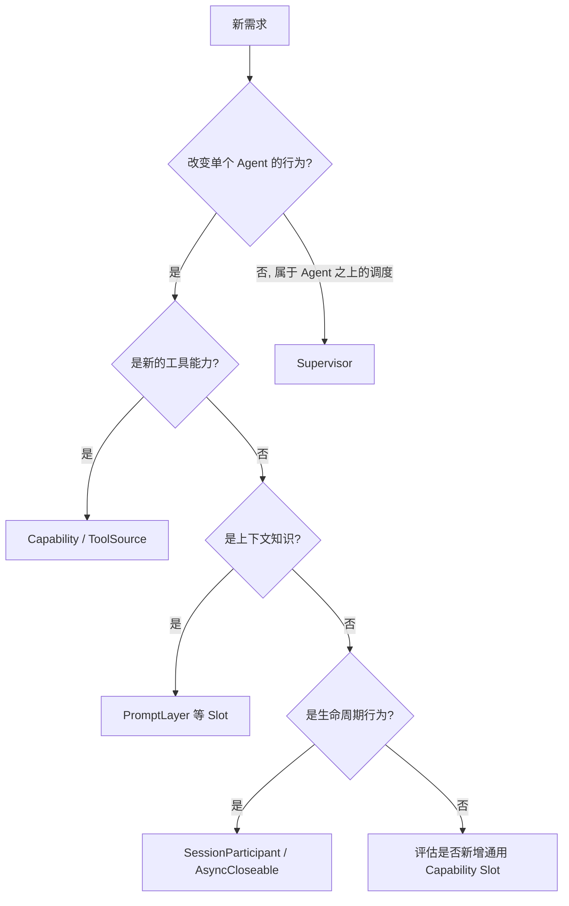

# Advanced Capability Development Guide（高级能力开发指南）

本文用于指导 Lion-Code 后续高级能力开发。

目标不是规定每个 Feature 的具体实现，而是回答一个问题：

> 当需要增加 Memory、MCP、Browser、Sandbox、Learning、Autonomy 等高级能力时，应该从哪里开始？

Lion-Code 的默认原则：

**优先扩展 Agent，而不是修改 Agent。**

---

## 1. 首先判断：这是哪一类能力？

新增需求进入开发前，先按本节归类。归类结果决定入口位置，也决定哪些文件允许被触碰。

### A. 给 Agent 增加“能做什么”

典型需求：MCP、Browser、Sandbox、Database、Search、外部 API。

入口：

```text
Capability
    ↓
ToolSource
    ↓
ToolRegistry
```

通常不需要修改：

```text
core/
runtime/
meta_agent.py
```

### B. 给 Agent 增加“知道什么”

典型需求：Memory、Project Context、用户偏好、动态环境信息、外部知识注入。

优先考虑的组合：

```text
Capability
├── PromptLayer
├── ToolSource
└── SessionParticipant
```

以 Memory 为例，一个典型拆分是：

```text
Memory Capability
├── PromptLayer          # 将必要记忆注入上下文
├── ToolSource           # 主动 search / get / write memory
├── SessionParticipant   # session 初始化 / 恢复
└── AsyncCloseable       # 数据库、后台资源
```

如果现有 Slot 无法表达需求，**不要直接修改 AgentRuntime**。先判断是否应该增加一个新的通用 Capability Slot。

### C. 给 Agent 增加“生命周期行为”

典型需求：Session 初始化、Session restore、Feature scoped state、长连接、后台资源。

入口：

```text
SessionParticipant
AsyncCloseable
```

Capability 自己拥有自己的状态。不要把 Feature state 放进：

```text
AgentRuntime
SessionRuntime
ConversationRuntime
ContextRuntime
```

### D. 给系统增加“Agent 之上的行为”

典型需求：长期自主运行、Retry / Recovery、多阶段任务、多 Agent 调度、Scheduler、Checkpoint、Autonomy。

优先从 **Supervisor** 开始，而不是 AgentRuntime。

基本判断标准：

```text
单个 Agent 如何完成一次工作      → Agent / Capability
多个 Agent / 多轮任务如何被调度  → Supervisor
```

### 决策速查



## 2. Capability 是默认高级功能入口

当前通用 Capability SPI：

```text
CapabilitySpec
├── ToolSource
├── PromptLayer
├── SessionParticipant
└── AsyncCloseable
```

新的 Feature 应优先建立自己的 package：

```text
lion_code/capabilities/<feature>/
├── __init__.py
├── capability.py
├── runtime.py
└── ...
```

例如：

```text
capabilities/memory/
capabilities/mcp/
capabilities/browser/
```

接入路径：

```text
CapabilitySpec
    ↓
Profile.extension_specs
    ↓
Composition Root
    ↓
Agent
```

Feature-specific construction 不应进入 Kernel 或 Runtime。

## 3. Composition 是唯一接线位置

如果一个高级能力需要 repository、client、database、provider、config、runtime、callback 等具体对象，它们之间的 concrete wiring 只能发生在：

```text
composition/
```

而不是：

```text
core/
runtime/
capabilities/types.py
```

原则：

```text
Capability   定义能力
Composition  创建并连接能力
Runtime      使用通用契约
```

不要让 Runtime 知道任何具体 Feature 类型，例如：

```text
MemoryRuntime
MCPClient
BrowserRuntime
LearningEngine
```

## 4. 哪些地方原则上不要修改？

增加普通高级能力时，以下区域默认视为稳定边界：

```text
core/
runtime/agent.py
runtime/conversation.py
runtime/session.py
runtime/context.py
runtime/provider.py
meta_agent.py
```

如果实现 Feature 时发现“必须修改这些文件”，先停止实现，重新判断：

1. 这是 Feature，还是新的通用 Runtime primitive？
2. 能否通过现有 Capability Slot 表达？
3. 是否应该增加一个新的通用 Capability Slot？
4. 是否实际上属于 Supervisor？

只有当**多个独立 Feature 都需要同一种机制**时，才考虑扩展通用 SPI。

## 5. 推荐开发顺序

```text
1. 定义 Feature 自己的职责和状态 Owner
        ↓
2. 判断需要哪些 Capability Slot
        ↓
3. 在 capabilities/<feature>/ 中实现
        ↓
4. 通过 CapabilitySpec 暴露贡献
        ↓
5. 在 Composition 中完成 concrete wiring
        ↓
6. 通过 extension_specs / Profile 选择启用
        ↓
7. 验证 Minimal Agent 未发生变化
```

最重要的验收条件：

> **删除这个 Capability 后，MetaAgent 和 Agent Runtime 仍然能够独立工作。**

## 6. 典型 Feature 的首选入口

| Feature | 首选入口 |
| --- | --- |
| MCP | ToolSource + AsyncCloseable |
| Browser | ToolSource + AsyncCloseable |
| Sandbox | ToolSource + AsyncCloseable |
| Memory | PromptLayer + ToolSource + SessionParticipant |
| Project Context | PromptLayer |
| Skill | Capability |
| SubAgent | Capability |
| Learning | Capability；必要时增加通用 lifecycle / event slot |
| Autonomous Execution | Supervisor |
| Multi-Agent Orchestration | Supervisor + Agent Factory |
| Scheduler | Supervisor |

## 7. 最终判断原则

添加一个高级能力时，优先问：

> “这个能力如何挂到 Agent 外面？”

而不是：

> “我要在哪里修改 Agent？”

理想的 Lion-Code Feature 应满足：

- Feature 可插拔
- Feature 自己拥有状态
- Runtime 不知道具体 Feature
- Kernel 不知道 Capability
- Composition 负责具体接线
- Supervisor 负责 Agent 之上的编排

如果新增 Memory、MCP、Browser 等能力需要大规模修改 Agent 本体，通常意味着 **Feature 边界设计错了**，而不是 Agent Runtime 缺少代码。

---

## 附：架构门禁第一条

后续所有高级功能 PR 的第一条架构门禁：

> **先判断需求应该进入 Capability、Composition 还是 Supervisor；默认不要从 Runtime 开始开发。**

## 附：架构门禁第二条（安全窄腰）

安全平面的全部承诺都建立在"窄腰覆盖全部路径"之上：

> **ToolRuntime 是工具调用的唯一路径。任何新工具（含 Capability 提供的
> ToolSource 贡献）自动继承 Output Sanitizer（输出 redact）、Egress Guard
> （出口控制）与权限判定，不得提供旁路执行通道；任何新的应用层网络出口
> （Browser、MCP 类）必须接入 Egress Guard 的 Level A 覆盖面，做不到的
> 显式标注 best_effort 并登记残余风险。**

判定入口见 `docs/security-design.md` 与 `.trellis/spec/backend/secret-boundary.md`、
`egress-guard.md`。
