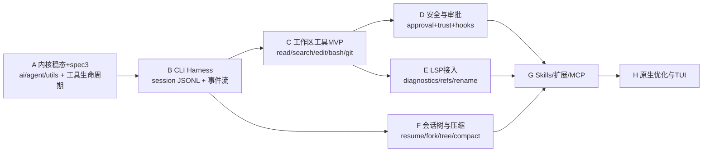

# 从 Nano 内核到 Coding Agent Harness 的闯关路线（综合 deep-research）设计

- **日期**：2026-06-24
- **状态**：设计待用户复审（本文是 2026-06-24 首版"架构精修"的**完整重写**，因 deep-research 报告大改）。
- **输入**：`deep-research-report.md`（v2：对 `muyuzhong/Nano`、`earendil-works/pi`、`can1357/oh-my-pi` 的对比研究）。
- **决策前提（用户 2026-06-24 拍板）**：
  1. **严格极简** —— 只保留内存态 + 协议接缝；非必要不落地后端（无 PG/Temporal/Redis/OTel）。
  2. **调和排期** —— 不是"内核全做完再碰 harness"，也不是"丢下内核直接搭壳"，而是：**P0 只做被 harness 真实需求拉动的内核机制（spec③ 工具生命周期），随即向外长 coding harness；内核 ④续跑/⑤provider 等 harness 用到时再补。**
- **本 spec 范围**：项目身份重定位 + 分层架构 + seam 目录 + 内核改动政策 + **闯关 A–H 路线图** + 验收门。不预先实现任何 harness 实体，本文只定方向与排期。

---

## 0. 项目身份重定位（v2 报告的核心转变）

deep-research v2 把建议从"做一个通用 Agent 平台 + 重型设施"改成一个**具体且克制**的方向，本 spec 采纳它：

> **Nano 不做"又一个 Agent Framework",而做"以 Nano 内核为中心、向 Pi 学分层、向 oh-my-pi 学工作区与会话能力"的 Python-first Coding Agent Harness。**

三个对标项目的定位（已核实报告论据）：

| 项目 | 是什么 | 给 Nano 的借鉴 |
|---|---|---|
| **Nano（本仓）** | Python 3.11 最小解耦内核：`ai + agent + utils`，机制/策略分离，`import-linter` 强制分层 | 保留为 framework kernel，**不动大骨架** |
| **Pi**（earendil-works/pi） | 最小 coding harness：核心小，靠 sessions/compaction/extensions/skills/RPC 外挂；**无内建权限系统**，强边界靠 sandbox | 薄产品层怎么分包、project trust、skills/extensions |
| **oh-my-pi**（can1357/oh-my-pi） | "终端里的 IDE 代理"：会话树、hooks、LSP、原生文件扫描缓存、hash-anchored edit、RPC/SDK | 真 coding agent 阶段的系统主轴 |

**收敛后的项目定位**：Python 内核优先、单仓渐进演进、产品层围绕"**项目工作区**"而非"聊天"展开。短期不追 Bun/Rust 全量复刻；高成本能力（原生扫描、TUI）做成后期可选 sidecar。

---

## 1. 现状核实（报告 v2 论断 vs 真实仓库）

| 报告论断 | 核实结果 |
|---|---|
| Nano 是 Python 3.11 最小内核，只做 ai/agent/utils | **属实**。 |
| 已实现 message model / stream events / tool execution / agent loop / stateful Agent + import-linter | **属实**。 |
| 近期在修内核稳态问题（上下文快照、工具 schema 防污染、ToolExecutionStart 参数快照、OpenAI 工具调用 delta） | **属实**。见 `agent-improvements.md`，当前 `pytest -q` **83 passed**。 |
| 还没有 harness / CLI/TUI / 权限策略 / 产品工具集 / 成熟会话层 | **属实**。 |
| `muyuzhong/Mono` 已重定向到 `muyuzhong/Nano`（仓库改名） | **报告论断**。本地 `git remote` 仍是 `…/Mono.git`（靠 GitHub 重定向工作）。**建议**：`git remote set-url origin https://github.com/muyuzhong/Nano.git` 收口命名。前版 spec 的"Mono vs NanoAgent 命名 ADR"由此**关闭**：主线名 = **Nano**。 |

---

## 2. 分层架构（内核三层不变，向外加 harness 层）

### 2.1 目标分层

内核 `utils → ai → agent` **完全不变**；harness 是**纯增量的上层包**，只能依赖内核，内核绝不反向依赖它。

```text
                 ┌─────────────────────────────────────────┐
   harness 层    │ cli            （呈现：CLI，后期 TUI）      │
   （新增，本 spec │ coding_agent   （编排：会话/模式/工具选择/审批装配） │
    只定方向）    │ workspace      （项目文件索引/搜索/编辑/diff/缓存 + 具体工具）│
                 │ memory         （compaction / 项目记忆）    │
                 └─────────────────────────────────────────┘
   内核（不变）   │ agent          （runtime：loop/tools 协议/control/事件）│
                 │ ai             （provider 抽象/wire 消息/流事件）        │
                 │ utils          （ids/logging）                        │
```

> `wire / sdk / rpc`（统一事件协议、外部 SDK）是**更外层、更后期**的关注点（闯关 G/H）。它本质是把内核**已稳定的事件契约**（`agent/events.py` G1–G7）序列化对外，不是新的核心依赖，故不进早期分层。

### 2.2 扩展后的 import-linter 分层契约（建 harness 时落地）

```ini
layers =
    nanoagent.cli
    nanoagent.coding_agent
    nanoagent.workspace | nanoagent.memory
    nanoagent.agent
    nanoagent.ai
    nanoagent.utils
```

`workspace` 与 `memory` 用**管道符 `|` 写在同一层**：import-linter 语义下，同层 sibling **互不可 import**（这才是"互不依赖"的正确表达），但都可依赖下层 `agent/ai/utils`、都可被上层 `coding_agent` 依赖。注意 `|`（独立 sibling）与 `:`（同层但可互相 import）不可混用。

> **关键决策点（命名冲突）**：内核已有 `nanoagent.agent.tools`（AgentTool 协议）与 `nanoagent.ai.tools`（wire Tool）。harness 的**具体工具**（read/search/edit/bash/git）建议落在 `nanoagent.workspace`（文件类）下，避免再起一个易混的顶层 `nanoagent.tools`。最终命名在闯关 C 拍板。

### 2.3 seam 目录（harness 契约面，标注消费方）

内核**已存在**的扩展点 —— harness 只用这些缝，不改内核（源码核实）。新增"被哪个闯关消费"列，作为调和排期的依据。

| 接缝 | 代码位置 | 当前形状 | 被哪个闯关消费 |
|---|---|---|---|
| Provider 抽象 + 注册表 | `ai/provider.py` | `Provider.stream`；`register/get/clear`；`registered_provider_apis()` | B（默认 provider 装配）、G（多 provider/MCP） |
| `convert_to_llm` | `agent/messages.py` | `list[AgentMessage]→list[Message]` | B（自定义消息）、F（压缩降级） |
| `transform_context` | `agent/context.py` | `async (msgs,signal)→msgs`，默认 no-op，入参已隔离 | **F（compaction 主缝）** |
| `ControlSource` | `agent/control.py` | `async request_approval(call,tier)→bool`，默认 `AllowAll` | **D（真审批；可能拉结构化 decision 增强）** |
| `before_tool_call` | `agent/tools.py`/`loop.py` | `async (call,params)→{block,reason}|None` | C（参数级红线）、D（执行前拦截） |
| `after_tool_call`（**待加，§4 Gate A**） | — | 尚无 | C（结果脱敏/截断）、D（审计） |
| `stream_fn` | `loop.py AgentLoopConfig` | 可注入替换 `ai.stream` | G（限流/录制包装）、⑤ |
| 事件订阅 | `agent/agent.py` | `Agent.subscribe`，先 reduce 再 emit | **B（事件流→JSONL/UI 的统一事实来源）** |
| steering 注入 | `loop.py`/`agent.py` | `get_steering_messages()` 在 turn 边界注入 | **F（续跑/follow-up 接入点）** |
| 终止契约 | `agent/result.py` | `RunResult(reason,final_message_id,error,detail)` | B（run 审计）、F（恢复判定） |

---

## 3. 内核改动政策（调和的关键纪律）

前版 spec 的原则是"建 harness 时内核 diff 应为空"。调和排期下，harness 会**合法地拉动少量内核机制**，故重述为：

> **harness 工作默认是增量的（在 agent 之上新增包）。它触碰内核，当且仅当某个闯关真实需要一个通用机制；每次触碰都必须过 §5 四关。若某闯关逼你往内核塞的不是干净机制（而是策略），停下评审。**

由此得到内核改动的**需求驱动映射**（不再"为完整性而做 ③④⑤"）：

| 内核机制 | 由哪个闯关拉动 | 现在做吗 |
|---|---|---|
| **spec③ 工具生命周期**（A0 结果通道 + 完成序 end / `tool_execution_update` / `after_tool_call`；**`terminate` 仅预留**） | **Gate C 工作区工具**（长跑 bash 要进度、并行 search、危险 git 串行） | **是（P0，见 Gate A）** |
| `terminate`（工具主动结束 run） | 出现终止型工具时（如 G 的 skills/任务完成工具） | 否（A0 预留槽位，需求出现再实现） |
| `ControlSource` 结构化 decision（allow/deny + reason + tier） | Gate D 安全审批（需要拒绝原因/分级） | D 时再定（默认 bool 够用就不动） |
| **spec④ 续跑/队列**（follow-up 注入点 + drain） | Gate F 会话树（/resume、续跑） | F 时再做 |
| **spec⑤ provider 成熟度**（可重试错误的注入缝 / 第二 provider 形状 / MCP host） | Gate G 扩展（多 provider、MCP） | G 时再做 |

---

## 4. 闯关路线图（A–H）

人日按 1–3 人小队估，误差 ±30%。每关给"目标 / 产出 / 验收 / 关键决策"。



### Gate A — 内核稳态 + spec③ 工具生命周期 · P0 · 4–6 人日

被 Gate C 真实拉动的内核机制，提前在 A 做实，因为工作区工具直接依赖它。

**A0（前置·必须先做）—— 设计工具执行结果/通道 `ToolExecutionOutcome`。** 现状断点：`AgentToolResult.details`（`tools.py:18`）在 `_run_one`（`tools.py:73`）转成 `ToolResultMessage` 时被**丢弃**，而 `ToolResultMessage`（`ai/messages.py:86-93`）本身**无 `details` 字段**——全仓 `grep details` 仅命中定义处、无人读取。也就是说"工具 → loop"边界现在只能传 `content` + `is_error`，承载不了进度、结构化元数据或终止信号。A2/A3（及将来的 terminate）都依赖一个不丢信息的结果/通道，故 **A0 先把这个结构设计好**，其余项在其上构建。

在 A0 之上做三项**机制**（对照 `loop.py` 现状）：

1. **完成序 `tool_execution_end`（并行工具）** —— *（与 A0 正交，可独立做）* 现状 `loop.py:264-272` await 全部后按源序批量发 end；目标：shared 工具谁先完成谁先发 end（消费者靠 `tool_call_id` 关联，G5 已允许、契约不破）。*（并行 search/read 要这个。）*
2. **真正产出 `tool_execution_update`** —— 类型存在（`events.py:134-139`）但无人产出；靠 A0 的进度通道让 `AgentTool.execute` 发进度，loop 转成 update 事件。*（长跑 bash/大搜索要进度。）*
3. **`after_tool_call(call, outcome) → outcome | None`** —— 对称补全（现仅 `before_tool_call`，`tools.py:65-68`），让 harness 在回填前脱敏/截断/审计；操作对象是 A0 的 outcome（才看得到 `details`）。

**`terminate` 不进 Gate A（需求驱动）**：当前 Gate C 工具（read/search/edit/bash/git diff）**没有**任何终止型工具，按 §3 纪律不为它提前加机制。A0 结构**预留** `terminate?` 槽位即可——等真出现终止型工具（如 Gate G 的 skills/任务完成工具）再实现 loop 侧收尾，避免二次改动执行边界。

- **产出**：A0 结构 + 三项机制 + 对应失败测试先行；seam 目录回填 `after_tool_call`。
- **验收**：`pytest -q` + `lint-imports` KEPT；A0 + 三项有回归；事件/工具 schema 不可外部污染（已有防护确认）。
- **关键决策**：`ToolExecutionOutcome` 是**替换** `AgentToolResult`、还是在它与 `ToolResultMessage` 之间**新增一层**；`execute` 进度通道用"可选 emit 回调"还是"async generator"。

### Gate B — CLI Harness（会话壳 + 事件流） · P0 · 6–8 人日

第一个真正消费内核 `Agent.subscribe` 事件流的 harness。

- **产出**：`nanoagent.cli` + 最小 `nanoagent.coding_agent`；session JSONL 持久化；事件流输出；`--mode json`；基础配置（provider/key 在此装配——**策略在 harness**）。
- **验收**：能 prompt、**在同一进程/同一 session 内追加后续 prompt（多轮对话）**、导出事件；一个完整 `prompt→事件→落 JSONL` 闭环。**跨进程 `/resume`、会话树与恢复属 Gate F，不在 B。**
- **关键决策**：会话格式是否兼容 Pi/omp 风格；先文件存储后内存 vs 反之；事件协议是否就用 JSONL（建议是）。

### Gate C — 工作区工具 MVP · P0 · 8–12 人日

让 agent 真正能读/搜/改/跑。**直接消费 Gate A 的 ③**。

- **产出**：`nanoagent.workspace`（项目文件索引/搜索/编辑/diff/缓存）+ 具体工具 `read / search / edit / bash / git diff`（均为 `AgentTool` 实现，挂 harness 层）+ 审计日志。
- **验收**：完成"读取→搜索→编辑→运行→diff"闭环。
- **关键决策**：编辑策略 = 文本 replace / 可验证 patch / hash-anchor（建议从可验证 patch 起步，hash-anchor 留 H）；shell 是否持久化 cwd/环境；bash 工具并发档（建议 `exclusive`）。

### Gate D — 安全与审批（trust / approval / hooks） · P0 · 5–7 人日

把 `AllowAll` 换成真边界。**可能拉动内核结构化 decision 增强（§3）**。

- **产出**：harness 侧 `ControlSource` 实现 + project trust + tool hooks + 红线命令示例（如 `rm -rf`、危险 git）。
- **验收**：写操作与危险 bash 可被拦截/确认/审计。
- **关键决策**：trust 文件位置；无 UI 场景默认拒绝 vs yolo；hook API 稳定度；是否此时把 `request_approval` 升级为结构化 decision。
- **安全依据**：Pi 明确无内建权限、强边界靠 sandbox；外部工具输出/检索结果须视为**不可信输入**（前版 AgentDojo 论据仍成立）。sandbox 本体属 harness/部署层。

### Gate E — LSP 接入 · P1 · 7–10 人日

从"文本代理"升级为"代码代理"。

- **产出**：`diagnostics / definition / references / rename` 封装为工具（基于微软 LSP 规范）。
- **验收**：至少 diagnostics + refs + rename，且 rename 能跨文件更新。
- **关键决策**：首批支持语言；rename 是否强依赖 `willRenameFiles`；LSP 不可用时的回退。

### Gate F — 会话树与压缩 · P1 · 6–9 人日

长任务可恢复/分叉/压缩。**拉动内核 spec④（续跑）+ `transform_context`（压缩缝已在）**。

- **产出**：`/resume /fork /tree /compact` + branch summary；`nanoagent.memory` 承接 compaction。
- **验收**：会话可续跑、分叉、压缩且能重建上下文。
- **关键决策**：compaction 是否首类 entry；摘要用同模型还是便宜模型；项目记忆 vs 会话摘要是否分层。

### Gate G — Skills / 扩展 / MCP · P1 · 6–9 人日

把策略沉淀为可插拔能力。**拉动内核 spec⑤（多 provider/MCP host）**。

- **产出**：skills、custom tools、RPC/MCP 适配（基于 MCP 官方文档）。
- **验收**：新技能/工具**无需改 core** 即可接入（这是对 §3 政策的最终检验）。
- **关键决策**：skill 是 prompt 资产还是半结构化 DSL；MCP 作 host tool 还是独立进程。

### Gate H — 原生优化与 TUI · P2 · 10–14 人日

性能、搜索与交互体验。

- **产出**：原生扫描缓存、可选 hash-anchor edit、TUI。
- **验收**：大仓搜索显著提速；TUI 不影响 core。
- **关键决策**：Python 原生还是 Rust sidecar；TUI 是否放第二仓库。

---

## 5. 边界纪律（验收门，沿用既有约束）

每往内核加东西（Gate A 的 ③、以及 D/F/G 拉动的机制），过 spec 2026-06-17 §7 **四关**，任一不过 → 属于 harness：

1. **两产品测试**：两个不同 coding agent 会不会"一模一样"地想要它？想要得不同 → 策略。
2. **默认值陷阱**：是数字/规则吗（重试 3 次、trust 默认、token 预算）？框架给旋钮，harness 拧数值。
3. **命名测试**：`agent`/`ai` 包绝不出现具体名字（read_file、rm -rf、某语言 LSP、某业务规则）。
4. **无副作用测试**：所有 I/O / 时钟 / 环境走注入端口。

机械护栏：`lint-imports` KEPT；**内核测试只用 mock**，不依赖真 provider/network/文件系统；harness 改动**默认不碰内核**，碰则评审。

---

## 6. 测试策略（三层）

- **内核单测**：覆盖 stream / tool / context / provider / mock（现有 83 测试延续）。
- **工作区集成测试**：用 fixture 仓库跑 `read-search-edit-bash-git(-lsp)` 任务闭环（Gate C 起）。
- **会话回放测试**：用 session JSONL 复现实例，验证会话重建、分叉、compaction（Gate F 起）。

节奏：沿用 `agent-improvements.md` 的"先写失败测试、再最小实现"。

---

## 7. 非目标（YAGNI，本阶段明确不做）

- 不复刻 oh-my-pi 全量能力；不做多代理编排平台。
- 不把 provider 选择、审批策略、UI 生命周期、业务规则塞回 `ai`/`agent` core。
- 短期不引入 Rust sidecar / native（先 Python 跑通，H 再议）。
- 不上重型设施：Postgres / Temporal / Redis / 对象存储 / OTel（会话先 JSONL；可观测先靠事件流）。
- 不预先实现任何 Gate 的实体——本文只定方向与排期。

---

## 8. 主要风险与缓解

| 风险 | 缓解 |
|---|---|
| 内核被产品逻辑侵蚀 | approval/trust/budget/UI 全放 harness；§5 四关 + import-linter |
| 编辑损坏文件 | 从可验证 patch 起步，hash-anchor 留 H |
| LSP 复杂度失控 | 先 diagnostics/refs/rename 三件套 |
| 长会话失真 | 尽早把 compaction + branch summary 做成首类 entry（F） |
| 命令执行风险 | hook + confirm + 审计日志拦截危险命令（D） |
| 性能瓶颈 | 先 Python 跑通，再把搜索/扫描迁 sidecar（H） |

---

## 9. 与既有文档的关系 + 下一步

- 本 spec 是 **roadmap 级**，**重写并取代** 2026-06-24 首版"架构精修"。spec 2026-06-17（框架设计）、2026-06-21（事件契约）保持有效，作为内核侧依据。
- 内核 ③④⑤ 不再单列优先级，而是**按 Gate 需求拉动**（③→A/C 现做，④→F，⑤→G）。
- README/AGENTS 可据 §0 更新项目身份为"Python-first Coding Agent Harness（内核 Nano）"。

**下一步（用户复审本 spec 后再定）**：
1. （推荐）用 `superpowers:writing-plans` 把 **Gate A（内核稳态 + spec③：A0 结果通道 + 完成序 end/update/after_tool_call）** 细化成逐任务、可 TDD 的实现计划——它是唯一无依赖、立即可做的 P0。
2. 或继续按 `agent-improvements.md` 小步节奏，先落 ③ 的单项。

**一句话总结**：报告 v2 方向对且更具体——把 Nano 长成一个边界干净的 **Python coding harness**。本 spec 的"调和"= **先做工作区工具真正需要的内核机制（spec③），随即闯关式向外长壳（CLI→工具→审批→LSP→会话→扩展→原生），内核其余能力需求驱动，全程用 seam 目录 + 四关守住纯度。**
